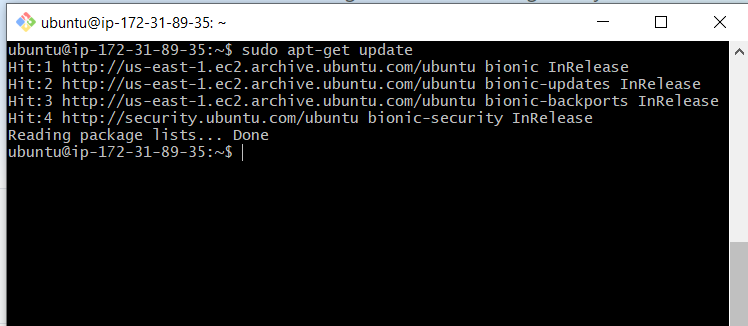

# 1. Conectarse a nuestra maquina por ssh, habilitar http en nuetro servidor, y crear estructura de carpetas
Yo lo voy a hacer desde la terminal MINGW, Primero de todo me conecto a mi maquina con la clave publica del servidor

Lo de habilitar el http es en el apartado ***Security groups*** una vez dentro en la pestaña ***Inbound*** tenemos que añadir una regla que sea el protocolo http escuchando por el puerto 80, en mi caso ya me lo venia hecho por defecto, al crear la maquina

Ahora crearemos

# 2. Instalacion y configuracion de Apache2
Antes de instalar nada actualizaremos los repositorios

y ahora instalaremos el servidor apache con el siguiente comando:

# 3. Instalacion del servidor de Bases de datos
Una aplicacion deberá disponer de un servidor de bases de datos y al menos una base de datos a la que conectarse, podremos hacerlo instalando MYSQL con el siguiente comando

Y despues configurando el servidor, tras escribir otro comando

Tras configurarlo ya podemos logearnos en MYSQL con nuestro usuario, y empezar a trabajar con las bases de datos

Podemos editar la configuracion desde el archivo 000-default.conf.
El ***DocumentRoot*** sera el directorio del cual el navegador cargara los archivos y directorio.

# 4. Instalacion del Servidor PHP
Instalamos PHP con el siguiente comando:

ahora escribimos en la url del navegador ***la_ direccion_de_nuestra maquina/info.php***
