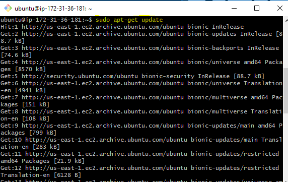

# 1. Conectarse a nuestra maquina por ssh y habilitar http
Yo lo voy a hacer desde la terminal MINGW, Primero de todo me conecto a mi maquina con la clave publica del servidor

Lo de habilitar el http es en el apartado ***Security groups*** una vez dentro en la pestaña ***Inbound*** tenemos que añadir una regla que sea el protocolo http escuchando por el puerto 80, en mi caso ya me lo venia hecho por defecto, al crear la maquina

# 2. Instalacion de Apache2
Antes de instalar nada actualizaremos los repositorios

y ahora instalaremos el servidor apache con el siguiente comando:
