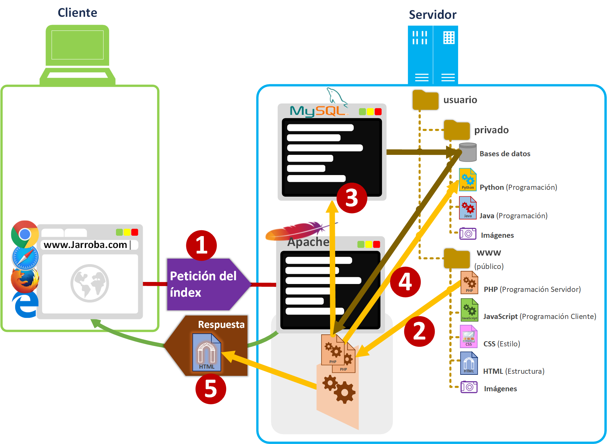

# TAREA 1: Crear un servidor para dar respuesta las necesidades de la aplicación a desarrollar.

 
> **RECUERDA** que debes tomar EVIDENCIAS y que debes **DOCUMENTAR** los pasos que vayas dando **a modo de tutorial** mientras realizas la tarea, con **pantallazos** y otras imágenes explicativas.
 
 
La aplicación web que vamos a desarrollar tendrá parte cliente y parte servidor.

La parte **cliente** aún está sin definir, no sabemos con qué tecnología se desarrollará. Pero sabemos que se comunicará con el servidor mediante el protocolo **HTTP** y/o **HTTPS**.

La parte **servidor** deberá ser capaz de recibir y servir peticiones de documentos de texto, imágenes y otros ficheros. Además el servidor deberá almacenar información estructurada, sea en ficheros o en bases de datos.

Como el desarrollo de la parte servidor lo vais a desarrollar vosotros, deberéis instalar y configurar **servicios** y **aplicaciones** que os procuren un entorno de desarrollo conocido. 

Aquí tenéis un ejemplo de cómo se van a comportar el **cliente** y el **servidor**. En este ejemplo, salvo el paso 4, pertenecen al funcionamiento habitual de un servidor **LAMP** (Linux, Apache, MySQL, PHP)

Para ver más información sobre el funcionamiento cliente-servidor os podéis documentar en **[www.jarroba.com/cliente-vs-servidor](https://jarroba.com/cliente-vs-servidor/)**
