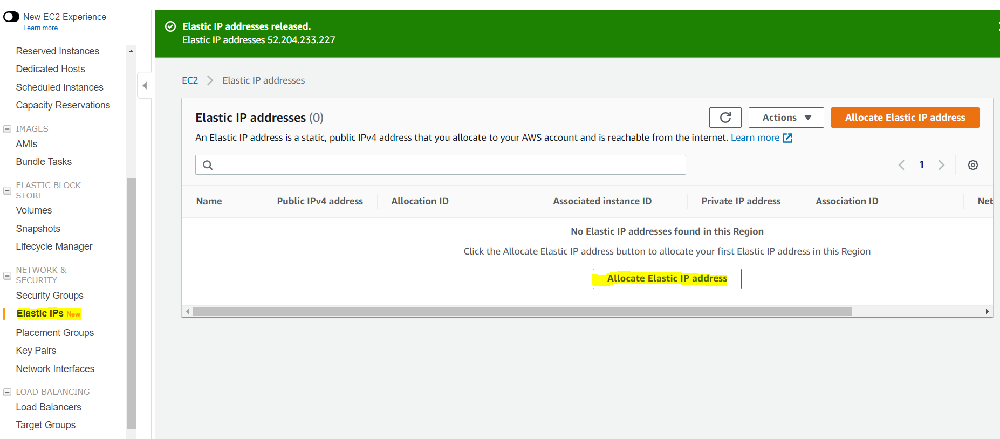
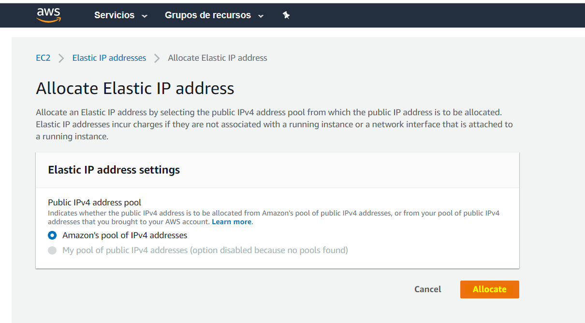
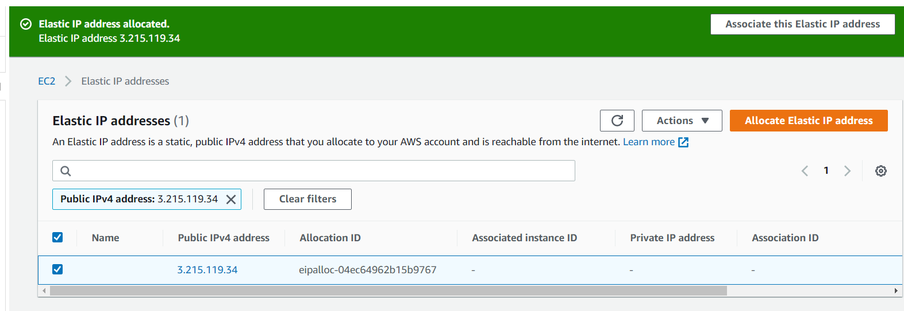
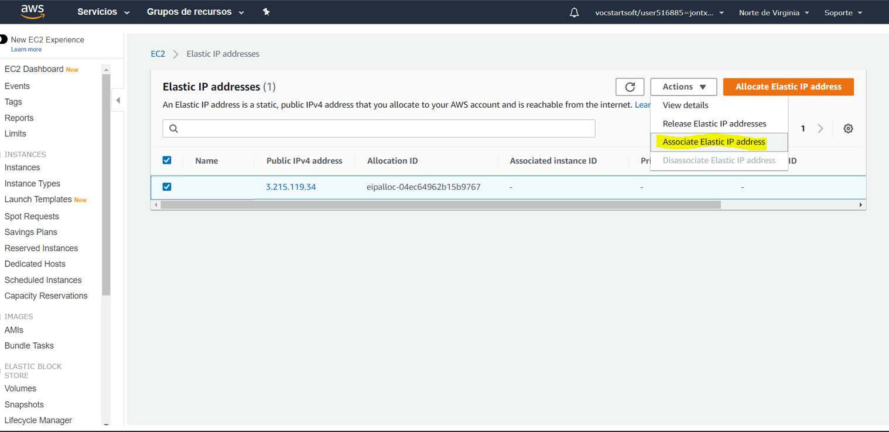
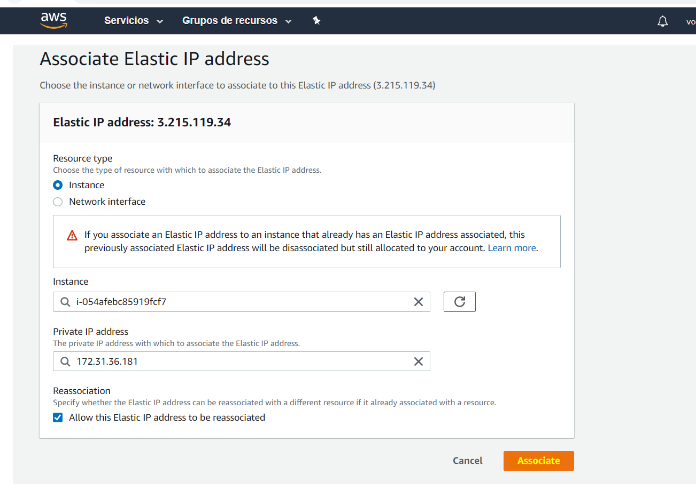
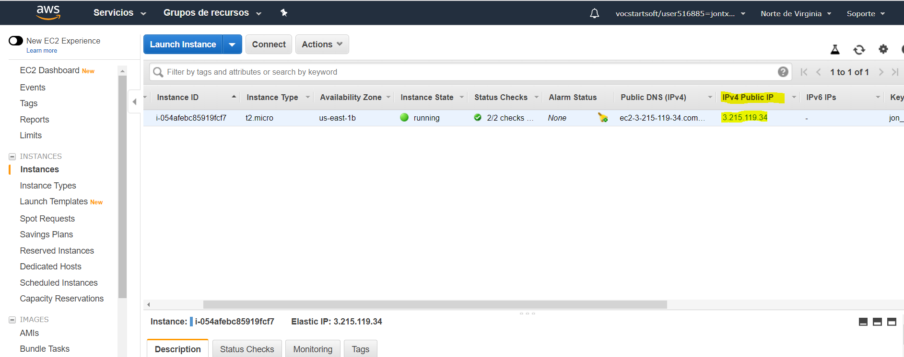
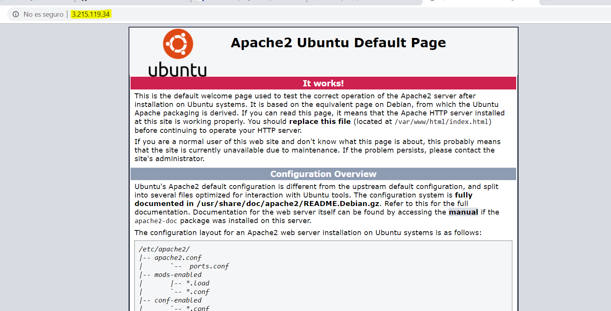

#***TAREA 2: Solventar problemas de direccionamiento***
Cada vez que se apaga/inicia un servidor EC2 su IP es renovada. Por tanto cada vez que quieres conectarte por SSH debes copiar la nueva IP desde el panel de instancias EC2 en AWS. Lo deseable sería tener siempre un mismo dominio/ip para hacer tanto conexiones SSH como HTTP a nuestro servidor.

Amazon AWS permite reservar una Elastic IP.

Infórmate sobre esto, realiza los ajustes necesarios en tu cuenta de AWS para poder usar siempre la misma URL a partir de ahora, y documenta los pasos que has dado para lograrlo.

Para poner una ip elastica a una instancia de AWS, tendremos que hacerlo desde el apartado ***Elastic IP's*** y una vez dentro a ***Allocate Elastic IP adress***

Seleccionamos la primera opcion y le damos a Allocate

Y de momento la hemos alquilado

Ahora tendremos que asociarla a nuestra instancia

Escribimos el ***nombre*** y la ***ip privada*** de la instancia a la que la asociaremos, y le damos a ***Associate***

Y ya esta, tenemos la Ip elastica creada anteriormente asociada a nuestra instancia

Una vez asociada escribimos esa direccion IP Elastica en el navegador y nos saldra el fichero index del virtualhost del servidor apache2 que tenemos instalado en la instancia

