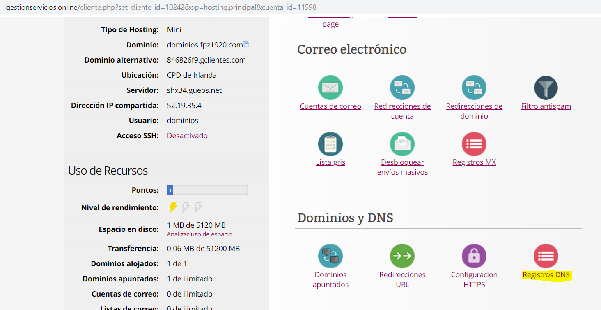

# TAREA 3: Gestión de DNS
Hasta ahora hemos usado ***GUEBS*** como alojamiento con un dominio asignado a cada grupo. Esto permitía ver facilmente el trabajo de cada grupo, solamente cambiando el nombre del subdominio.

Con el fin de ***facilitar la escritura*** de la url del servidor EC2 de cada uno de vosotros, se os ha creado otro hosting compartido llamado dominios.fpz1920.com. A través del panel de este hosting deberéis crear el vínculo entre un nuevo subdominio que lleve vuestro nombre y vuestra instancia en EC2:

minombre.dominios.fpz1920.com ---> instancia en EC2

***Infórmate*** y ***realiza*** los ajustes necesarios. ***Documenta*** los pasos que has dado.

Durante el proceso deberás elegir el ***Tipo*** de registro DNS. ***Describe en tu documentación** los distintos tipos de registros DNS (Qué son y cúando utilizarlos)

Esto lo haremos desde el panel de gestion de servicios online, cuando estemos en el, le damos a ***Registros DNS***

En ***Nombre*** ponemos el nombre del subdominio a crear, en ***TTL*** yo no lo he cambiado. ***Tipo*** A, y ***Dirección*** La direccion ip elastica de nuestra instancia. ya puesto los datos le damos a ***Añadir registro DNS***

* NOTA: Antes de darle a ***Añadir registro DNS*** hay seleccionar el dominio, en la casilla ***Selecciona dominio a gestionar***

Y ya lo hemos creado

para comprobar que funciona, Escribiremos la direccion del dominio completa en la url

