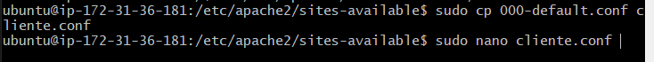
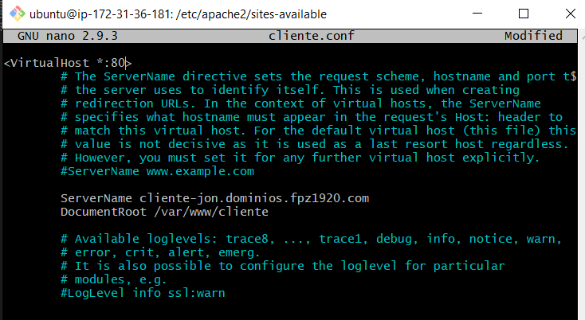
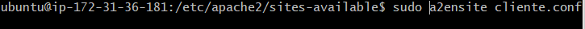
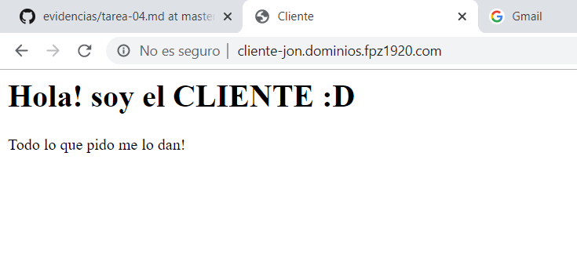
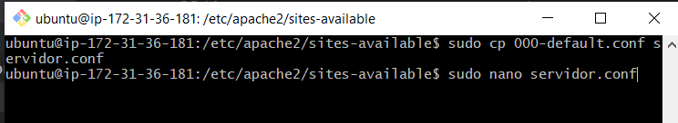
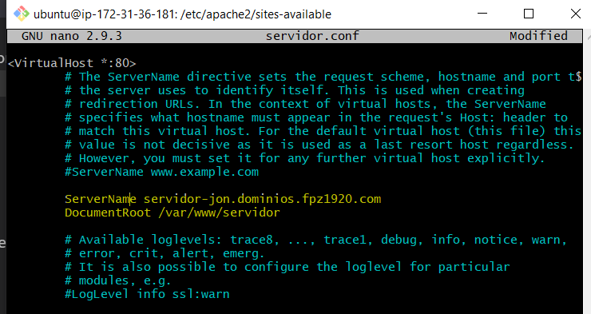
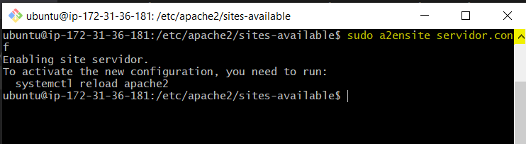
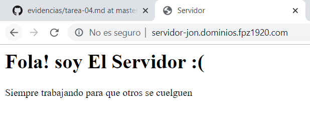

# TAREA 4: Virtual hosts
Los siguientes pasos se deberan de realizar despues de crear los subdominios y sus correscondientes carpetas en ***/var/www*** con su archivo ***index.html*** cada uno

Primero crearemos el archivo de configuracion para el cliente

Y editamos las lineas ***Servername*** poniendo la direccion URL por la que se buscara, y ***DocumentRoot*** de donde va a cargar el index el servidor apache2

habilitamos el sitio con el siguiente comando

y escribimos la direccion de dominio en el navegador

Ahora vamos a hacer lo mismo para el servidor

Editamos lasdos lineas ***ServerName*** ***DocumentRoot***

Habilitamos el sitio

Y escribimos la direccion de dominio en la URL del navegador para comprobar

