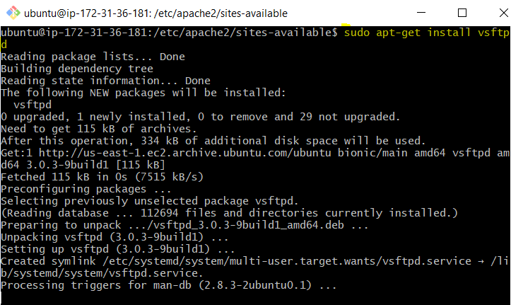

# TAREA 5: Servidor FTP
Podemos instalar el ***vsftpd*** que viene siendo el servidor FTP en GNU/Linux

En el archivo de configuracion deberemos de tener escritas las siguientes lineas

Una vez instalado, vamos a conectarnos al servidor desde otra maquina, via comandos. para que esto sea posible, en la instancia de amazon tenemos que añadir una regla de entrada que admita conexiones por el puerto 21

Ahora vamos a probar a conectarnos al servidor FTP

nos da respuesta, pero el usuario no es valido. Vamos a crearlos.
El usuario admin, cliente y servidor, cada uno con los directorios donde podra realizar cambios

Por ultimo nos conectaremos al servidor ftp con los tres usuarios creados anteriormente, y comprobaremos que esten en su correspondiente directorio

El usuario admin

El usuario cliente

El usuario servidor

