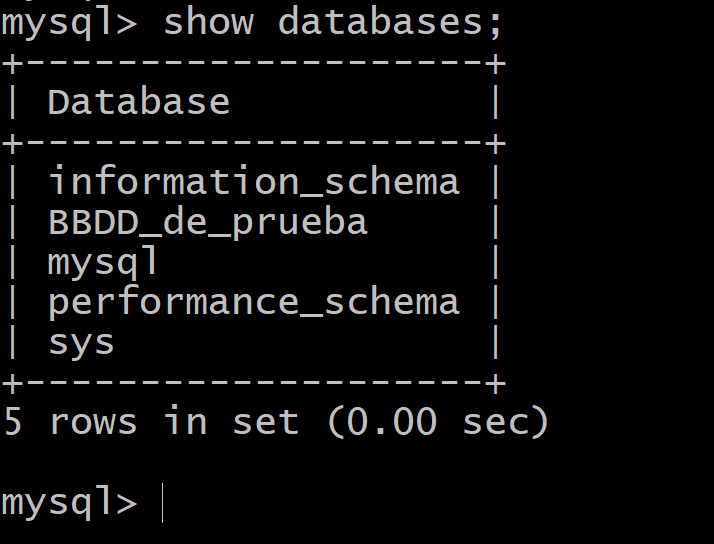

Crear copias de seguridad mediante comandos
FICHEROS Y DIRECTORIOS
En tareas anteriores has creado el espacio para cliente y servidor dentro de /var/www.

Utiliza el comando TAR para crear una copia empaquetada y comprimida de los directorios y sus ficheros.

Documenta cómo hacer estas copias.

El comando tar tiene tres opciones
-c: para crear el archivo TAR
-v: muestra imformacion sobre el proceso de compresion
-f: el que se le va a dar al archivo

Vamos a crear un archivo comprimido del directorio www en otro directorio para probar, lo haremos con el siguiente comando

Una vez hagamos eso, usamos el comando ***ls*** para  er si esta ahí el .gz

Ahora vamos a extraer ese .gz en otro directorio, para probar

La opcion -C es para poder extraerlo en otro directorio distinto al actual

En ese directorio comprobamos que se ha extraido el ***.gz*** usando el comando ***ls***

BASES DE DATOS
Además de los ficheros se debe realizar una copia del volcado de todas las bases de datos. ¿Conoces los comandos necesarios para hacer el volcado y crear el fichero comprimido?

Primero de todo nos logeamos en ***mySQL*** y con ela orden ***show databases*** veremos algunas bases de datos, vamos a realizar una copia de todas estas dentro de un solo fichero

descargaremos todas las BBDD en un solo fichero, utilizando el siguiente comando

y usamos ***ls*** para ver que se ha creado el fichero

