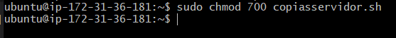
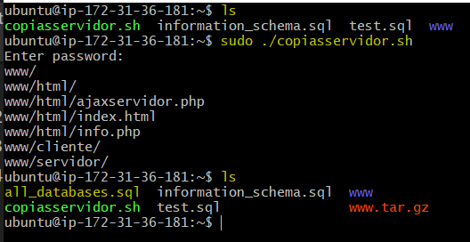
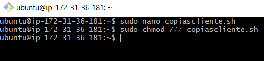
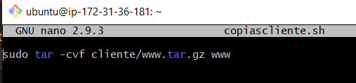
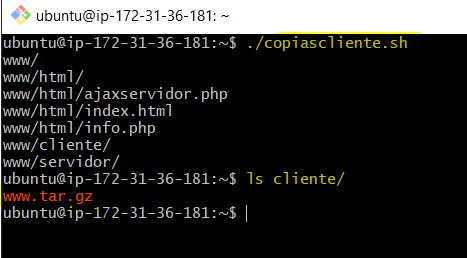
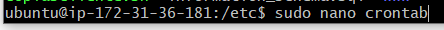
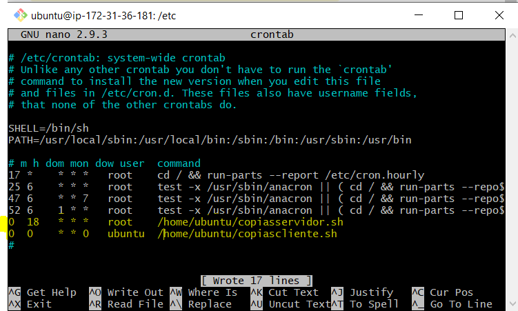
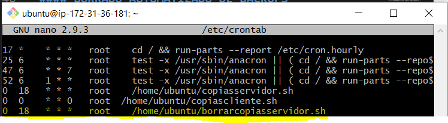
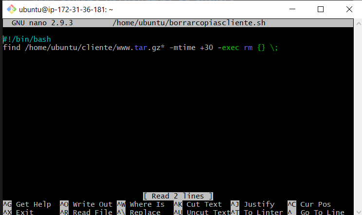
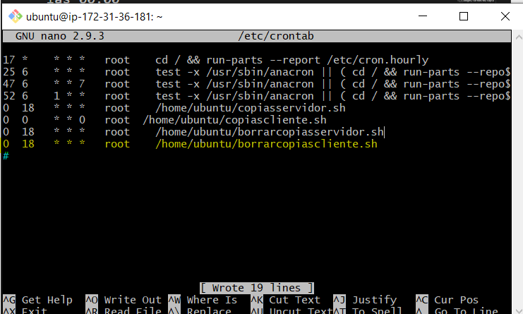

# TAREA 7: Automatizar copias de seguridad
#### CREAR LOS SCRIPT PARA CLIENTE Y SERVIDOR
Primero vamos a crear el script para el servidor,y le diremos que cada vez que este se ejecute, creara una copia de la carpeta con el proyecto, y una copia de todas las bases de datos del servidor

Le damos permisos. En este caso que solo el usuario root pueda ejecutarlo

Ahora ejecutamos el script, y podemos ver que donde antes no habia, se han creado una backup de todas las bases de datos y una copia del proyecto de la carpeta ***www***

 Vamos a repetir estos mismos pasos para crear el script para el cliente

En este caso solo una copia de la carpeta del proyecto

Y despues de crearlo lo ejecutamos y comprueba que funciona

#### AUTOMATIZAR
Vamos a utilizar crontab para que los script creados anteriormente se vayan ejecutandose solos cada cierto tiempo.
Lo haremos editando el archivo de la ruta ***/etc/crontab***

y añadiremos las siguientes lineas.
En mi caso le dire que guarde la version del proyecto para el servidor, diariamente a las 18:00. Y la copia para el cliente cada semana a las 00:00

#### BORRADO AUTOMATIZADO DE BACKUPS
Voy a crear un script un script que vaya a eliminar los archivos que se llamen igual que las copias de seguridad que vaya creando el otro script, y que hayan sido creados hace mas de 7 dias.

Y despues en crontab le dire que vaya ejecutando este script, en mi caso lo hara cada dia

Ahora el script del cliente, en este caso le diremos que borre las copias de seguridad de hace mas de un mes, porque estas van ser creadas cada una semana

Y en el crontab le diremos que se ejecute a diario el script

