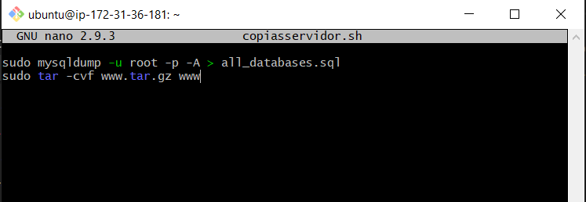

# TAREA 7: Automatizar copias de seguridad
#### CREAR LOS SCRIPT PARA CLIENTE Y SERVIDOR
Primero vamos a crear el script para el servidor,y le diremos que cada vez que este se ejecute, creara una copia de la carpeta con el proyecto, y una copia de todas las bases de datos del servidor

Le damos permisos. En este caso que solo el usuario root pueda ejecutarlo

Ahora ejecutamos el script, y podemos ver que donde antes no habia, se han creado una backup de todas las bases de datos y una copia del proyecto de la carpeta ***www***

 Vamos a repetir estos mismos pasos para crear el script para el cliente

En este caso solo una copia de la carpeta del proyecto

Y despues de crearlo lo ejecutamos y comprueba que funciona

#### AUTOMATIZAR
Vamos a utilizar crontab para que los script creados anteriormente se vayan ejecutandose solos cada cierto tiempo.
Lo haremos con el siguiente comando:

Ten en cuenta que los datos del servidor se modifican (con la interacción de los usuarios de la aplicación web) con mayor frecuencia que las del cliente (que solo los modifica el equipo desarrollador), por tanto deberían hacerse más copias del servidor que del cliente.

#### BORRADO AUTOMATIZADO DE BACKUPS
Al automatizar las copias de seguridad se crearán ficheros backup de forma periódica que ocuparán cada vez más espacio en disco. Teniendo en cuenta esto idea otro script para borrar los backups más antiguos de forma periódica y automatizalo con crontab.